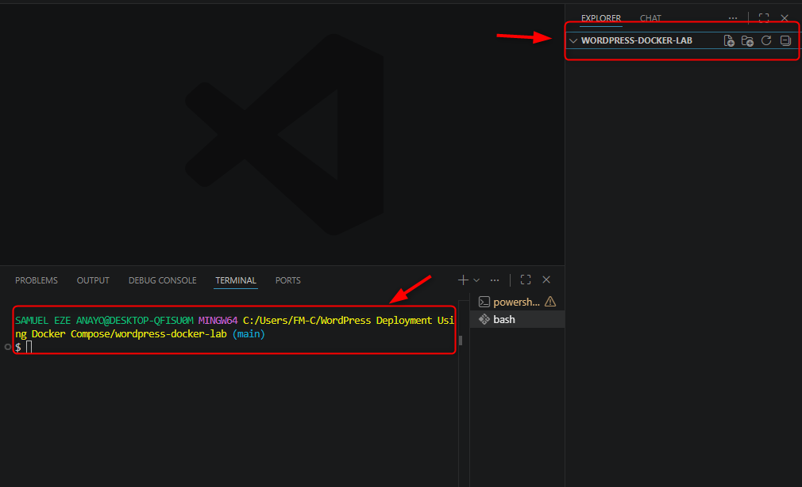
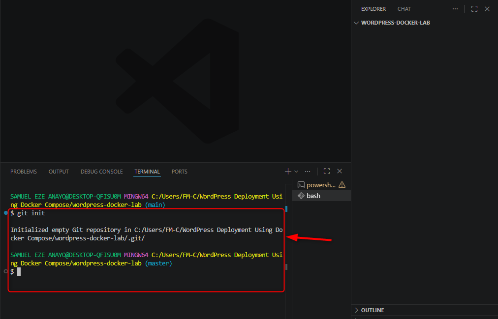
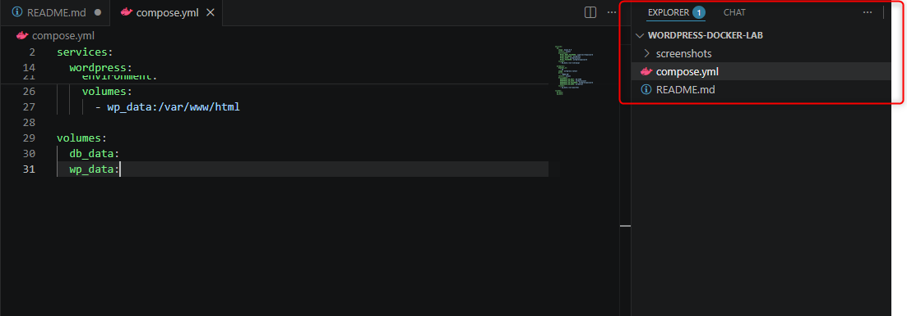
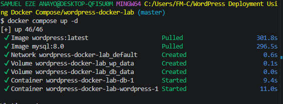
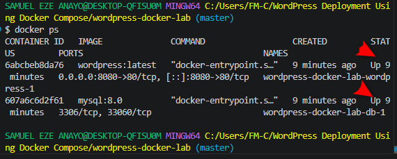
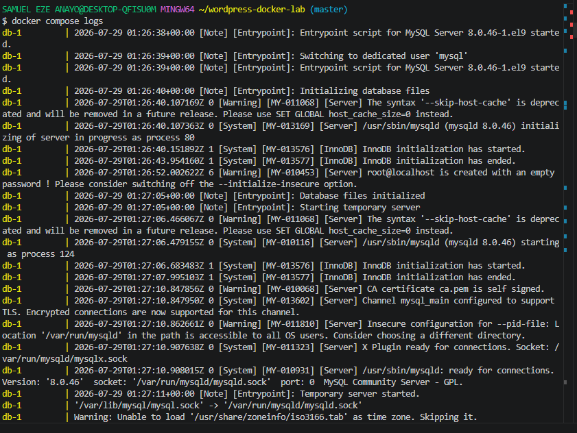
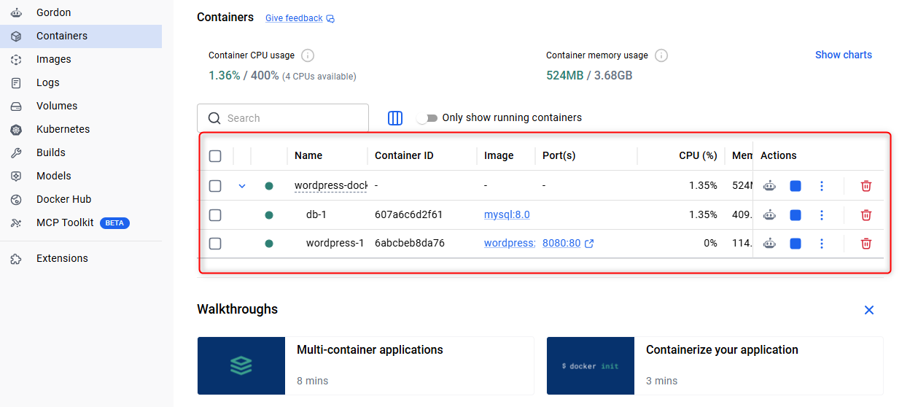
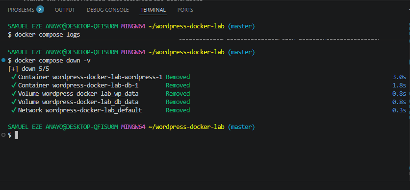
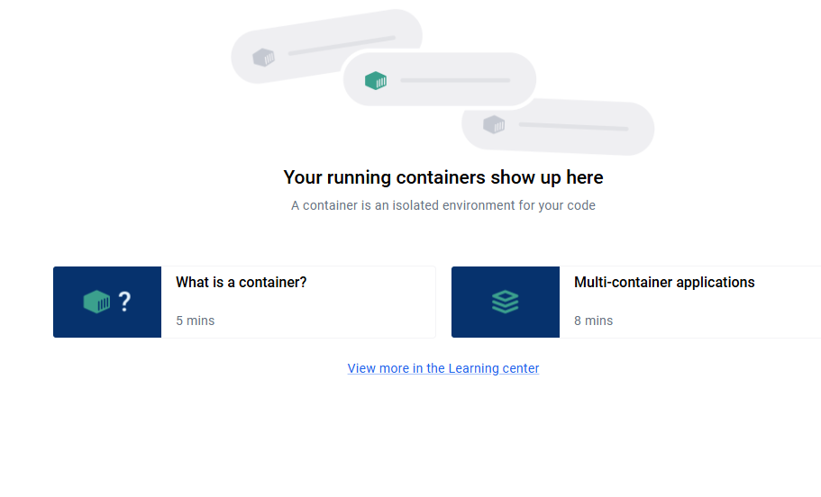

# 🐳 WordPress Deployment Using Docker Compose

## 📋 Project Overview

This project demonstrates how to deploy a multi-container WordPress application using Docker Compose.

The deployment consists of two containers:

- WordPress
- MySQL 8.0

Docker Compose is used to automate the deployment, networking, and management of both containers using a single configuration file (`docker-compose.yml`).

Throughout this project, Git was used for version control, and the completed project was prepared for publication on GitHub as part of a Cloud/DevOps portfolio.

---

## 🛠️ Technologies Used

- Docker
- Docker Compose
- WordPress
- MySQL 8.0
- Git
- GitHub
- Visual Studio Code

---

## ✅ Prerequisites

Before starting this project, ensure the following software is installed:

- Docker Desktop
- Git
- Visual Studio Code

Verify the installations by running:

```bash
docker --version
docker compose version
git --version
```

---

## 📁 Project Structure

```text
wordpress-docker-lab
│
├── docker-compose.yml
├── README.md
└── screenshots/
```

---

# 🚧 Deployment Steps
## 📂 Step 1 — Create the Project Directory

### Objective

Create a dedicated project workspace to store all project files, configuration files, documentation, and screenshots.

### Command Executed

```bash
mkdir wordpress-docker-lab
cd wordpress-docker-lab
code .
```

### Explanation

The following commands were executed:

- `mkdir wordpress-docker-lab` creates a new project directory.
- `cd wordpress-docker-lab` changes the current working directory to the project folder.
- `code .` opens the project folder in Visual Studio Code.

Using a dedicated project folder keeps all resources organized and makes project management easier.

### Verification

The project folder was successfully opened in Visual Studio Code, and the Explorer panel displayed the newly created workspace.

### Screenshot

**Figure 1:** Project folder opened in Visual Studio Code.



### Outcome

A dedicated project workspace was successfully created and prepared for the WordPress Docker Compose deployment.

---
## 🔧 Step 2 — Initialize the Git Repository

### Objective

Initialize a local Git repository to enable version control and prepare the project for publication on GitHub.

### Command Executed

```bash
git init
```

### Explanation

The `git init` command creates a new Git repository in the current project directory. This allows Git to begin tracking changes made to project files throughout the development process.

Initializing the repository at the beginning of the project ensures that all modifications can be committed, versioned, and pushed to GitHub.

### Verification

After executing the command, Git displayed a message similar to:

```text
Initialized empty Git repository in /path/to/wordpress-docker-lab/.git/
```

This confirms that the repository was successfully initialized.

### Screenshot
**Figure 2:** Git repository initialized.



 ### **Outcome**

A local Git repository was successfully created, enabling version control for the project and preparing it for future commits and GitHub deployment.

---
## **📄 Step 3 — Create the Project Files**

### **Objective**

Create the project files and directories required for the WordPress Docker Compose deployment and documentation.

### **Commands Executed**

```bash

touch README.md docker-compose.yml

```

### Explanation

The following files and directory were created:

- `README.md` – Documents the project, deployment process, and outcomes.
- `compose.yml` – Defines the Docker Compose configuration for deploying the WordPress and MySQL services.
- `screenshots/` – Stores screenshots captured throughout the deployment process.

Creating these resources before deployment ensures that the project remains organized and that documentation is maintained alongside development.

### Verification

The project structure was verified in Visual Studio Code, confirming that all required files and the `screenshots` directory were successfully created.

### Screenshot
**Figure 3:** Project files in the Docker Compose project directory.



The project structure was successfully prepared, providing a well-organized workspace for the Docker Compose deployment and supporting documentation.

---
## ⚙️ Step 4 — Configure Docker Compose

### Objective

Create a Docker Compose configuration file to define and deploy the WordPress application and MySQL database as a multi-container environment.

### Command Executed
**Figure 4:**

```bash
cat << 'EOF' > docker-compose.yml
services:
  db:
    image: mysql:8.0
    restart: always
    environment:
      MYSQL_ROOT_PASSWORD: supersecretpassword
      MYSQL_DATABASE: wordpress
      MYSQL_USER: wordpressuser
      MYSQL_PASSWORD: wordpresspassword
    volumes:
      - db_data:/var/lib/mysql

  wordpress:
    depends_on:
      - db
    image: wordpress:latest
    ports:
      - "8080:80"
    restart: always
    environment:
      WORDPRESS_DB_HOST: db:3306
      WORDPRESS_DB_USER: wordpressuser
      WORDPRESS_DB_PASSWORD: wordpresspassword
      WORDPRESS_DB_NAME: wordpress
    volumes:
      - wp_data:/var/www/html

volumes:
  db_data:
  wp_data:
EOF
```

---
## 🚀 Step 5 — Deploy the WordPress Stack

### Objective

Deploy the WordPress and MySQL containers defined in the `docker-compose.yml` configuration file.

### Command Executed

```bash
docker compose up -d
```

### Explanation

The `docker compose up -d` command reads the `docker-compose.yml` file and performs the following tasks:

- Pulls the required Docker images if they are not already available locally.
- Creates the Docker network for container communication.
- Creates the persistent Docker volumes (`db_data` and `wp_data`).
- Creates the MySQL and WordPress containers.
- Starts both containers in detached mode (`-d`), allowing them to run in the background.

### Verification

The deployment completed successfully, and Docker created the required containers, network, and volumes without errors.

### Screenshot

**Figure 5:** Running the Docker Compose application.


### Outcome

The WordPress application stack was successfully deployed using Docker Compose, with both the WordPress and MySQL services running as containers.

---
## 🔍 Step 6 — Verify the Running Containers

### Objective

Verify that the WordPress and MySQL containers were successfully deployed and are running.

### Command Executed

```bash
docker compose ps
```

### Explanation

The `docker compose ps` command displays the status of all services managed by Docker Compose.

This command is used to confirm that:

- The WordPress container is running.
- The MySQL container is running.
- Both services started successfully after deployment.

### Verification

The output displayed both containers with a status of **Up**, confirming that the deployment completed successfully.

### Screenshot
**Figure 6:** Verifying that the Docker Compose services are running.




### Outcome

The WordPress and MySQL containers were successfully deployed and verified to be running, confirming that the Docker Compose configuration was functioning as expected.

---
## 📜 Step 7 — Inspect Container Logs

### Objective

Inspect the logs generated by the WordPress and MySQL containers to verify that both services started successfully and to identify any startup errors or warnings.

### Command Executed

```bash
docker compose logs --tail 20
```

### Explanation

The `docker compose logs --tail 20` command displays the last **20 log entries** from all services defined in the Docker Compose project.

Reviewing the logs helps to:

- Confirm that the WordPress container started successfully.
- Confirm that the MySQL database initialized successfully.
- Detect configuration issues or runtime errors.
- Verify communication between the WordPress and MySQL containers.

The `--tail 20` option limits the output to the most recent log entries, making it easier to review the latest container activity.

### Verification

The deployment was verified using both the **Visual Studio Code terminal** and **Docker Desktop**.

**Visual Studio Code (CLI)**

The following command was executed:

```bash
docker compose logs --tail 20
```

The output confirmed that both the WordPress and MySQL containers started successfully without critical errors.

**Docker Desktop (GUI)**

The deployment was also verified using Docker Desktop by:

1. Opening **Docker Desktop**.
2. Navigating to **Containers**.
3. Selecting the running WordPress and MySQL containers.
4. Opening the **Logs** tab to review the container output.

The logs displayed in Docker Desktop matched the output produced by the Docker CLI, confirming that both services were operating correctly.

### Screenshot

**Figure 7:** Docker Compose logs.



**Figure 8:** Container logs viewed in Docker Desktop.




### Outcome

Both the Docker CLI and Docker Desktop confirmed that the WordPress and MySQL containers initialized successfully and were operating as expected.

---
## 🧹 Step 8 — Remove the Deployment

### Objective

Stop and remove all containers, networks, and Docker volumes created during the deployment to return the environment to a clean state.

### Command Executed

```bash
docker compose down -v
```

### Explanation

The `docker compose down -v` command stops and removes all containers, the Docker network, and the named Docker volumes created by the deployment.

Unlike `docker compose down`, which leaves the volumes intact, the `-v` option also removes:

- `db_data`
- `wp_data`

Removing the volumes permanently deletes the MySQL database and WordPress application data, allowing the deployment to start from a completely fresh state during the next lab.

### Verification

The cleanup was verified using both the **Visual Studio Code terminal** and **Docker Desktop**.

**Visual Studio Code (CLI)**

The following command was executed:

```bash
docker compose down -v
```

The terminal confirmed that the containers, network, and Docker volumes were successfully removed.

**Docker Desktop (GUI)**

Docker Desktop was opened to verify that:

- The WordPress container had been removed.
- The MySQL container had been removed.
- The Docker Compose application no longer appeared in the Containers view.
- The associated Docker volumes had been deleted.

### Screenshot
**Figure 09:** Docker cli after cleaning up the Docker Compose application.



**Figure 10:** Docker Desktop after cleaning up the Docker Compose application.



### Outcome

The Docker Compose deployment and all associated resources, including the persistent Docker volumes, were successfully removed, restoring the environment to a clean state.

---
## 🐞 Troubleshooting

| Issue | Cause | Resolution |
|--------|-------|------------|
| Docker images not found | Images had not been downloaded | Ran `docker compose up -d` to pull the required images. |
| Containers failed to start | Incorrect Docker Compose configuration | Reviewed and corrected the `docker-compose.yml` file. |
| Unable to access WordPress | Containers were still starting | Waited for the MySQL service to initialize before refreshing the browser. |

## 🎓 Lessons Learned

Through this project, I learned how to:

- Deploy a multi-container application using Docker Compose.
- Configure a WordPress application with a MySQL database.
- Create and manage Docker volumes for persistent storage.
- Inspect running containers and review container logs.
- Verify deployments using both the Docker CLI and Docker Desktop.
- Remove containers, networks, and volumes to restore a clean environment.
- Track project progress using Git before publishing to GitHub.

## ✅ Conclusion

This project successfully demonstrated the deployment and management of a multi-container WordPress application using Docker Compose.

The deployment included container orchestration, persistent storage, service verification, log inspection, and complete environment cleanup. Throughout the project, Git was used for version control, and the completed solution was prepared for publication on GitHub as part of a Cloud and DevOps portfolio.

## 🐙 Publish to GitHub

### Stage Changes

```bash
git add .
```

### Commit Changes

```bash
git commit -m "Deploy WordPress using Docker Compose"
```

### Connect Remote Repository

```bash
git remote add origin https://github.com/samueleze1/wordpress-docker-lab.git
```

### Push to GitHub

```bash
git branch -M main
git push -u origin main
```
## 📁 Repository Structure

```text
wordpress-docker-lab
│
├── docker-compose.yml
├── README.md
└── screenshots
    ├── 01-project-folder.png
    ├── 02-git-init.png
    ├── 03-project-files.png
    ├── 04-compose-file.png
    ├── 05-compose-up.png
    ├── 06-compose-ps.png
    ├── 07-compose-logs.png
    ├── 08-docker-desktop-logs.png
    ├── 09-compose-down.png
    ├── 10-docker-desktop-cleanup.png
```